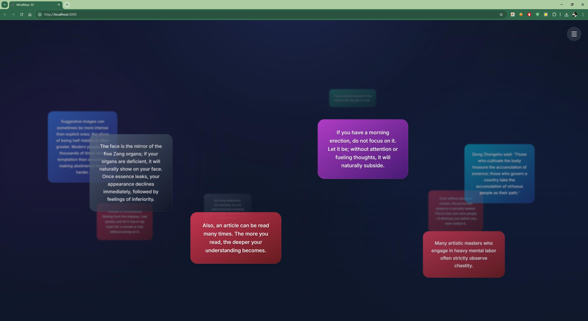

# 戒色励志 3D 心智图

<div align="center">
  
</div>

<div align="center">
  
</div>

## 关于应用

这是一个创新的 3D 心智图应用，专门为戒色励志而设计。通过动态展示中英文双语的金句名言，帮助用户在戒色道路上获得精神力量和正面指引。

## 核心特性

### 🎯 戒色主题内容
- **115+ 精选戒色金句** - 涵盖中医养生、现代心理学、传统文化智慧
- **双语支持** - 中英文对照，适合不同背景用户
- **内容分类丰富** - 从生理危害到心理建设，从戒色方法到励志名言

### 🎨 3D 视觉体验
- **动态旋转展示** - 金句以 3D 方式环绕旋转，视觉效果出众
- **物理碰撞效果** - 卡片间的碰撞模拟，增加真实感
- **多彩卡片系统** - 10种颜色主题，视觉效果丰富
- **流畅动画过渡** - 基于 Framer Motion 的丝滑动画

### ⚙️ 强大功能
- **实时内容替换** - 自动循环展示不同金句，保持新鲜感
- **自定义设置** - 调节速度、数量、文字长度等参数
- **卡片编辑** - 支持添加、编辑、删除自定义内容
- **本地存储** - 自动保存用户设置和自定义内容
- **响应式设计** - 适配各种屏幕尺寸

## 技术架构

- **React 19** - 现代化前端框架
- **TypeScript** - 类型安全开发
- **Framer Motion** - 高性能动画库
- **Vite** - 快速构建工具
- **Lucide React** - 现代图标库

## 快速开始

### 环境要求
- Node.js 16+
- npm 或 yarn

### 安装运行

1. **安装依赖**
   ```bash
   npm install
   ```

2. **启动开发服务器**
   ```bash
   npm run dev
   ```

3. **构建生产版本**
   ```bash
   npm run build
   ```

4. **预览构建结果**
   ```bash
   npm run preview
   ```

## 使用指南

### 基本操作
- **鼠标拖拽** - 旋转 3D 视角
- **右键菜单** - 编辑或删除卡片
- **工具栏** - 控制播放状态和侧边栏
- **侧边栏** - 调整各种参数设置

### 高级功能
- **添加自定义卡片** - 在侧边栏输入文字并选择颜色
- **编辑现有内容** - 右键点击卡片选择编辑
- **语言切换** - 一键切换中英文显示
- **暂停/播放** - 控制动画播放状态

## 内容特色

### 🏛️ 传统智慧
- 董仲舒、王阳明等圣贤名言
- 中医养生理论精华
- 古典戒色智慧语录

### 🔬 现代科学
- 神经科学研究成果
- 心理学 addiction 理论
- 生理健康医学知识

### 💪 励志故事
- 戒色成功案例分享
- 名人戒色经历
- 个人成长心得

## 开发说明

### 项目结构
```
├── components/          # React 组件
│   ├── Background.tsx   # 背景网格
│   ├── FloatingCard.tsx # 3D 卡片
│   ├── Sidebar.tsx      # 侧边栏控制
│   └── Toolbar.tsx      # 顶部工具栏
├── data.ts             # 金句数据源
├── types.ts            # TypeScript 类型定义
└── App.tsx             # 主应用组件
```

### 自定义开发
- **添加新金句** - 在 `data.ts` 中的 `SOURCE_DATA` 数组添加内容
- **修改颜色主题** - 在 `types.ts` 的 `CardColor` 枚举中定义新颜色
- **调整物理参数** - 在 `App.tsx` 中修改碰撞检测和旋转速度参数

## 浏览器兼容性

- Chrome 90+
- Firefox 88+
- Safari 14+
- Edge 90+

## 贡献指南

欢迎提交 Issue 和 Pull Request 来改进这个项目。

### 贡献方式
1. Fork 本仓库
2. 创建特性分支 (`git checkout -b feature/AmazingFeature`)
3. 提交更改 (`git commit -m 'Add some AmazingFeature'`)
4. 推送到分支 (`git push origin feature/AmazingFeature`)
5. 创建 Pull Request

## 许可证

本项目采用 MIT 许可证 - 查看 [LICENSE](LICENSE) 文件了解详情。

## 致谢

感谢所有为戒色事业贡献智慧和经验的人们，是你们的分享让这个世界变得更美好。

---

<div align="center">
  <p>💪 坚持戒色，重塑人生 💪</p>
  <p>🌟 每一次进步，都是更好的自己 🌟</p>
</div># the-reasons-to-quit-porn
# the-reasons-to-quit-porn
